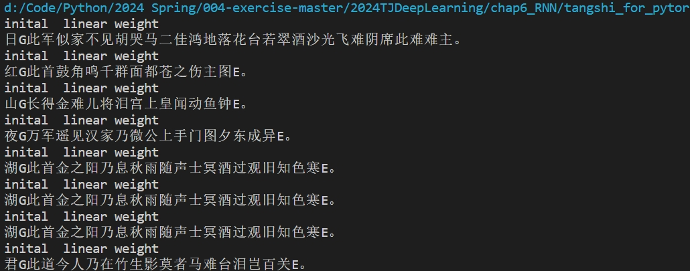

<h1 style="text-align:center;">DeepLearning HW3 -- RNN</h1>

<h3 style="text-align:center;">2152032 张铭锐</h3>

### 1.Completion Program

---

### 1.1 Learn2Carry-exercise

Firstly, the first blank is myRNNModel, which needs to be filled with the call function in the model. From the figure below, it can be seen that the role of the model is to calculate the result of adding two integers. Therefore, in the call function, I implemented the addition and carry of tensor lists in tensorflow. The final prediction results can be viewed in the Learn2Carry exercise. ipynb file.

~~~ python
class myRNNModel(keras.Model):
    def __init__(self):
        super(myRNNModel, self).__init__()
        self.embed_layer = tf.keras.layers.Embedding(10, 32, 
                                                    batch_input_shape=[None, None])
        
        self.rnncell = tf.keras.layers.SimpleRNNCell(64)
        self.rnn_layer = tf.keras.layers.RNN(self.rnncell, return_sequences=True)
        self.dense = tf.keras.layers.Dense(10)
        
    @tf.function
    def call(self, num1, num2):
        '''
        此处完成上述图中模型
        '''
        
        result = tf.zeros_like(num1)  # 初始化一个与num1形状相同且元素为0的张量result
        carry = tf.zeros([num1.shape[0]], dtype=tf.int32)  # 初始化一个形状为(batch_size,)且元素为0的张量carry，用于存储进位信息
        for i in range(num1.shape[1]):
            # 计算num1和num2对应位置的元素以及上一位的进位之和
            sum_with_carry = num1[:, i:i+1] + num2[:, i:i+1] + carry
            # 在result张量中更新对应位置的元素值为和的个位数（对10取模）
            result = tf.tensor_scatter_nd_update(
                result,
                indices=[[j, i] for j in range(num1.shape[0])],  # 要更新的行索引
                updates=sum_with_carry[:, 0] % 10  # 更新为和的个位数
            )
            # 更新carry张量，用于下一位的进位计算（整数除法）
            carry = sum_with_carry // 10
            
        
        x = result  
        
        x = self.embed_layer(x)
        x = self.rnn_layer(x)
        logits = self.dense(x)
        return logits
~~~

### 1.2 poem_generation_with_RNN-exercise

The second blank is still the call function for completing the model, using embedlayer, rnnlayer, and denselayer.

~~~ python
class myRNNModel(keras.Model):
    def __init__(self, w2id):
        super(myRNNModel, self).__init__()
        self.v_sz = len(w2id)
        self.embed_layer = tf.keras.layers.Embedding(self.v_sz, 64, 
                                                    batch_input_shape=[None, None])
        
        self.rnncell = tf.keras.layers.SimpleRNNCell(128)
        self.rnn_layer = tf.keras.layers.RNN(self.rnncell, return_sequences=True)
        self.dense = tf.keras.layers.Dense(self.v_sz)
        
    @tf.function
    def call(self, inp_ids):
        '''
        此处完成建模过程，可以参考Learn2Carry
        '''
        inp_emb = self.embed_layer(inp_ids)
        rnn_output = self.rnn_layer(inp_emb)
        logits = self.dense(rnn_output)
        return logits
    
    @tf.function
    def get_next_token(self, x, state):
        '''
        shape(x) = [b_sz,] 
        '''
    
        inp_emb = self.embed_layer(x) #shape(b_sz, emb_sz)
        h, state = self.rnncell.call(inp_emb, state) # shape(b_sz, h_sz)
        logits = self.dense(h) # shape(b_sz, v_sz)
        out = tf.argmax(logits, axis=-1)
        return out, state
~~~

The third blank is to complete the train_one_step function, which can refer to the previous train_one_step function, which is relatively simple.

~~~ python
@tf.function
def train_one_step(model, optimizer, x, y, seqlen):
    '''
    完成一步优化过程，可以参考之前做过的模型
    '''
    with tf.GradientTape() as tape:
        logits = model(x)
        loss = compute_loss(logits, y, seqlen)
    
    grads = tape.gradient(loss, model.trainable_variables)
    optimizer.apply_gradients(zip(grads, model.trainable_variables))    
    return loss
~~~

The running results can be viewed in the pool_generation_with RNN exercise. ipynb file.

### 2. Explain Models

---

### 2.1 RNN

RNN (Recurrent Neural Network), is a type of neural network designed for sequence data, where the output depends not only on the current input but also on previous inputs in the sequence. It has a recurrent connection that allows information to persist over time, making it suitable for tasks like time series prediction, language modeling, and sequence generation.

### 2.2 LSTM
 LSTM (Long Short-Term Memory), is a variant of RNN that addresses the vanishing gradient problem, which can occur in traditional RNNs when training on long sequences. LSTM introduces specialized units called memory cells that can learn long-term dependencies by selectively remembering or forgetting information over time. This makes LSTM networks more effective for tasks requiring modeling of long-range dependencies, such as language translation and speech recognition.

### 2.3 GRU
GRU (Gated Recurrent Unit), is another variant of RNN that simplifies the architecture compared to LSTM while achieving similar performance. It combines the gating mechanisms of LSTM (which control the flow of information) into a single update gate, making it computationally more efficient. GRU is commonly used in applications where memory efficiency is important, such as in large-scale sequence modeling and natural language processing tasks.

### 3. The Process of Generating Poems
---
### 3.1 Data Processing
The process_poems2 function reads poems from a file (tangshi.txt) and preprocesses them. It removes unwanted characters, tokenizes the poems into characters, and creates a mapping of characters to integer indices (word_int_map).
The poems are sorted by length and converted into vectors (poems_vector) where each poem is represented as a sequence of integers corresponding to the indices of characters in the vocabulary.
The generate_batch function creates batches of input-output pairs for training the RNN model. It divides the poems into chunks based on the batch size, creates input sequences (x_batches) and target sequences (y_batches) where each target sequence is the input sequence shifted by one position.
### 3.2 Model Training
The run_training function sets up the RNN model using the RNN_model class from the rnn module. It defines the model architecture with an embedding layer, RNN layer, and linear layer, and initializes the optimizer and loss function.
The model is trained using backpropagation through time (BPTT) for multiple epochs. Within each epoch, batches of input-output pairs are fed into the model, predictions are made, and the model parameters are updated to minimize the loss.
### 3.3 Poem Generation
The gen_poem function generates a poem given a starting word. It loads the trained RNN model, initializes the poem with the starting word, and iteratively predicts the next word using the model until an end token is reached or the poem length exceeds a certain limit.

### 4. Poems
---
For details, please refer to "./tangshi_for_pytorch/main. py". You can run it on your own to obtain the results